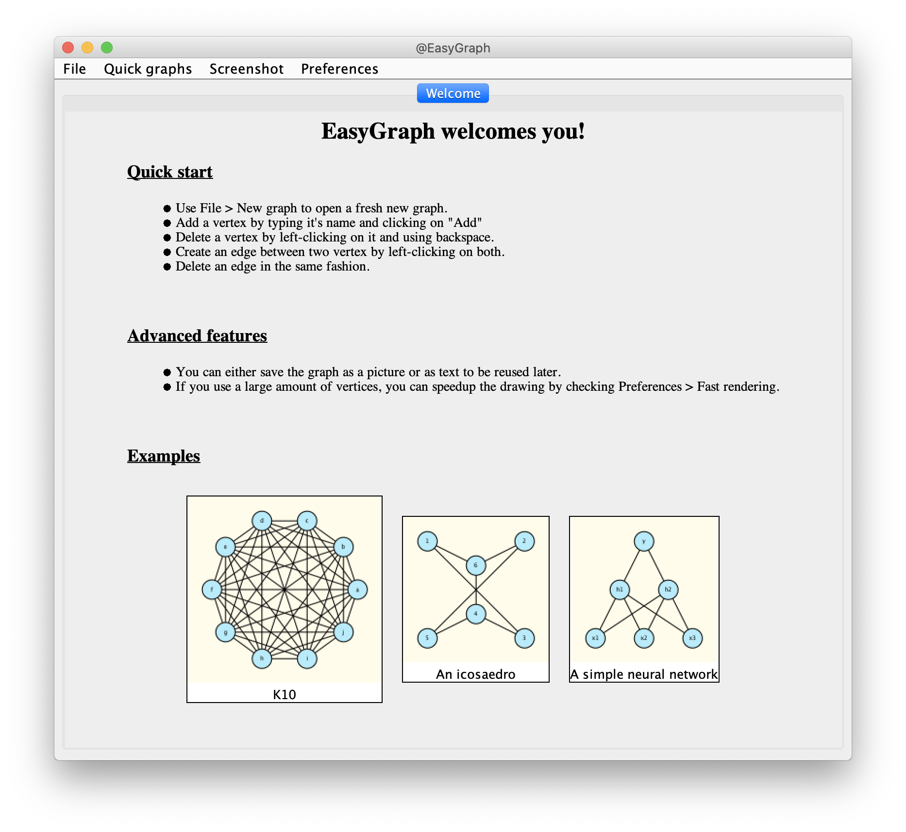
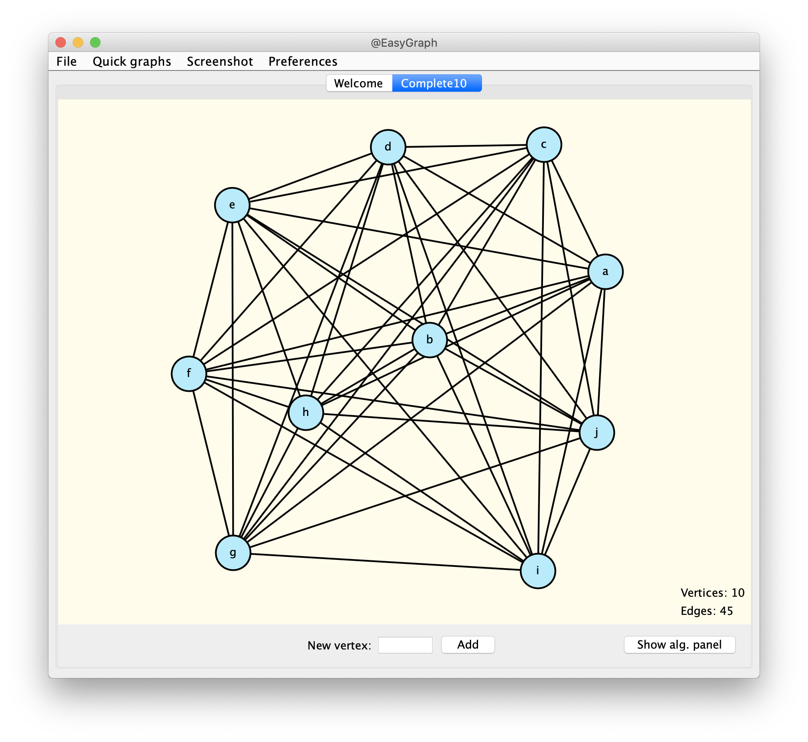
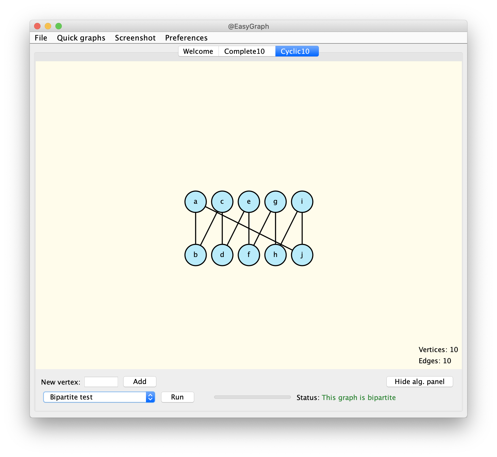

# EasyGraph

A desktop app to create, read, update and display graphs together with a framework to run graph algorithms.

## How to Run

1. Make sure Java is installed on your machine.
2. Double-click on EasyGraph.jar.
3. Altervatively, run ```java -jar <path_to_jar>``` in your favorite terminal.

## Code Highlights

Some nice Swing programming. A nice engine to run your own algorithm -- it is not too hard to add it to the app.

## Sample Screenshots

  
